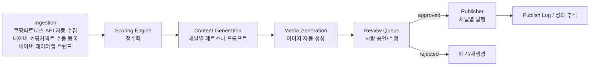

# auto-cpna

쿠팡파트너스 + 네이버 쇼핑커넥트 연동 AI 소셜 커머스 콘텐츠 파이프라인.
**완전 자동화가 아니라 "반자동(Human-in-the-loop)" 파이프라인**으로 설계되어 있습니다.
발행 직전 사람의 승인 단계를 거치는 이유는 아래 "왜 반자동인가" 참고.

## 지원하는 제휴 프로그램 (Product.source)

| source | 상품 수집 | 비고 |
|---|---|---|
| `coupang_partners` (기본값) | `autocpna score`로 자동 수집 | 쿠팡파트너스 오픈 API 사용 |
| `naver_shopping_connect` | `autocpna add-product`로 수동 등록 | 네이버 쇼핑커넥트는 크리에이터가 상품을 직접 골라 링크를 발급받는 구조라 2026-09 기준 공개 API가 없음. 링크/수수료율을 사람이 확인해 입력하면 이후 콘텐츠 생성·검수·발행은 쿠팡 상품과 동일한 파이프라인을 탐 |

두 프로그램 모두 콘텐츠에 들어가는 제휴 고지 문구는 `content_gen/base.py`의 `DISCLOSURE_TEXT`에서 source별로 다르게 관리되어, 실제 제휴 관계와 다른 프로그램명이 고지되지 않도록 합니다.

## 데이터 흐름



## 왜 반자동인가

| 채널 | 발행 방식 | 이유 |
|---|---|---|
| Instagram / Threads | 승인 후 API 자동 발행 (`channels.yaml`에서 `requires_review` 조정 가능) | Meta Graph API가 비즈니스 계정 예약 발행을 공식 지원 |
| 네이버 블로그 | **항상 초안만 생성, 발행은 수동** | 네이버는 공식 자동 포스팅 API가 없고, 자동화 도구로 올리면 어뷰징으로 계정 정지 위험이 큼 |

`config/channels.yaml`의 `requires_review` 플래그로 채널별 자동/반자동 정책을 조정합니다.

## 디렉터리 구조

```
config/                 페르소나, 채널 정책, 스코어링 가중치 (YAML)
src/autocpna/
  models/               DB 모델 (Product, ContentDraft, PublishLog)
  ingestion/            외부 데이터 수집 (쿠팡파트너스, 네이버 데이터랩)
  scoring/              점수화 엔진
  content_gen/          채널별 AI 콘텐츠 생성 (Claude API)
  media_gen/            이미지 자동 생성 연동
  review/               사람 검수 큐
  publish/              채널별 발행기
  pipeline/             전체 파이프라인 오케스트레이션
  cli.py                커맨드라인 진입점
dashboard/              검수용 대시보드 (Streamlit)
tests/
```

## 설치

```bash
python -m venv .venv && source .venv/bin/activate
pip install -e ".[dev]"
cp .env.example .env  # API 키 채우기
```

## 실행

```bash
# 1) 상품 수집 + 점수화
autocpna score

# 2) 상위 N개 상품에 대해 채널별 콘텐츠 초안 생성 (인스타/스레드는 상품 단위, 블로그는 단일 리뷰)
autocpna generate --top 10

# 2b) 네이버 블로그용 'OO 추천 TOP N' 비교 콘텐츠 (기본 컨셉)
autocpna generate-comparison --topic "무선 이어폰" --category "이어폰" --top 5

# 1b) 네이버 쇼핑커넥트처럼 자동 수집 API가 없는 상품은 수동 등록 (링크/수수료율은 직접 확인)
autocpna add-product --name "유기농 핸드크림" --category "뷰티" --price 15000 \
  --url "https://shoppingconnect.naver.com/..." --margin-rate 0.15 --keyword "핸드크림"

# 3) 검수 대기열 확인
autocpna review list

# 4) 승인 (승인된 항목 중 requires_review=false 채널은 자동 발행됨)
autocpna review approve <draft_id>

# 5) 발행 (auto 채널은 approve 시 자동 실행되지만, 수동 트리거도 가능)
autocpna publish --draft-id <draft_id>
```

검수는 CLI 대신 `streamlit run dashboard/app.py` 로 이미지+카피를 보면서 본문/해시태그를 직접 수정한 뒤 승인/반려할 수도 있습니다 (승인 버튼을 누르면 화면에 입력된 수정 내용이 먼저 저장됩니다). CLI에서는 `autocpna review edit <draft_id> --body "..." --hashtags "..."`로 동일하게 수정 가능합니다.

## 필요한 API 키 (.env)

- `ANTHROPIC_API_KEY` — 콘텐츠 생성
- `COUPANG_PARTNERS_ACCESS_KEY` / `COUPANG_PARTNERS_SECRET_KEY`
- `NAVER_DATALAB_CLIENT_ID` / `NAVER_DATALAB_CLIENT_SECRET` — 2026년 네이버 API HUB 이관 이후에는 NCP 콘솔에서 발급받은 키를 사용 (기존 개발자센터 키는 이관 신청을 마친 경우에 한해 유예기간 동안 `NaverDatalabClient(use_legacy_endpoint=True)`로 대체 가능)
- `META_PAGE_ACCESS_TOKEN` / `META_IG_BUSINESS_ID` — Instagram 발행
- `META_THREADS_ACCESS_TOKEN` / `META_THREADS_USER_ID` — Threads 발행 (Threads 자체 OAuth로 발급, Meta Page 토큰과 다름)
- (선택) 이미지 생성 제공자 키 — `media_gen/image_generator.py` 참고
- `CLOUDINARY_CLOUD_NAME` / `CLOUDINARY_API_KEY` / `CLOUDINARY_API_SECRET` — Instagram 발행용 이미지 공개 호스팅 (미설정 시 로컬 경로를 그대로 두고, 발행 시점에 명확한 오류로 안내)

## 아직 구현되지 않은 부분 (다음 단계)

- **conversion_rate(전환율)**: 상품/카테고리 단위 자체 클릭 로그는 아직 없지만, 쿠팡파트너스 커미션 리포트 API(`ingestion/coupang_reports.py`)로 최근 30일 계정 전체 실측 전환율(총 주문수/총 클릭수)을 계산해 사용함. 리포트 조회가 실패하면(신규 계정 등) `scoring_weights.yaml`의 `default_conversion_rate`로 대체
- **seasonality_fit(시의성)**: 네이버 데이터랩 월별 검색 트렌드(`NaverDatalabClient.fetch_monthly_series`)로 이번 달이 과거 대비 성수기인지를 계산 (`scoring/normalize.py`의 `compute_seasonality_fit`). 키워드 히스토리가 충분치 않거나(2개월 미만) API 호출이 실패하면 0.0으로 폴백
- `media_gen/openai_image_generator.py`: OpenAI(gpt-image-1)로 실제 연동됨, `generate` 실행 시 인스타그램 초안에 이미지가 자동 생성되어 `media_output/images/`에 저장됨. `IMAGE_GEN_API_KEY` 필요 (호출당 비용 발생하니 대량 생성 전 단가 확인할 것)
- `publish/instagram_publisher.py`: 실제 토큰으로 테스트 필요. 이미지 공개 호스팅은 `media_gen/cloudinary_uploader.py`로 연동됨 — `generate_drafts`가 OpenAI로 이미지를 로컬 생성한 직후 Cloudinary에 업로드해 그 `secure_url`을 초안의 `image_path`로 저장함(`pipeline/orchestrator.py`의 `_host_image_publicly`). Cloudinary 키가 없거나 업로드가 실패하면 로컬 경로로 폴백되고, 이 경우 발행 시점에 Instagram 발행기가 "공개 URL 아님" 오류로 명확히 막아줌
- `publish/threads_publisher.py`: 실제 토큰으로 테스트 필요. `META_THREADS_ACCESS_TOKEN`은 Meta Page 토큰과 별도로 Threads 자체 OAuth(threads_basic, threads_content_publish 스코프)로 발급받아야 함
- 대시보드는 최소 기능만 구현 (목록/승인/반려), 이미지 미리보기는 로컬 파일 경로 기준
