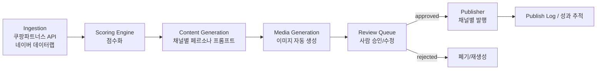

# auto-cpna

쿠팡파트너스 + 네이버 쇼핑 연동 AI 소셜 커머스 콘텐츠 파이프라인.
**완전 자동화가 아니라 "반자동(Human-in-the-loop)" 파이프라인**으로 설계되어 있습니다.
발행 직전 사람의 승인 단계를 거치는 이유는 아래 "왜 반자동인가" 참고.

## 데이터 흐름



## 왜 반자동인가

| 채널 | 발행 방식 | 이유 |
|---|---|---|
| Instagram / Threads | 승인 후 API 자동 발행 (`channels.yaml`에서 `requires_review` 조정 가능) | Meta Graph API가 비즈니스 계정 예약 발행을 공식 지원 |
| 네이버 블로그 | **항상 초안만 생성, 발행은 수동** | 네이버는 공식 자동 포스팅 API가 없고, 자동화 도구로 올리면 어뷰징으로 계정 정지 위험이 큼 |

`config/channels.yaml`의 `requires_review` 플래그로 채널별 자동/반자동 정책을 조정합니다.

## 디렉터리 구조

```
config/                 페르소나, 채널 정책, 스코어링 가중치 (YAML)
src/autocpna/
  models/               DB 모델 (Product, ContentDraft, PublishLog)
  ingestion/            외부 데이터 수집 (쿠팡파트너스, 네이버 데이터랩)
  scoring/              점수화 엔진
  content_gen/          채널별 AI 콘텐츠 생성 (Claude API)
  media_gen/            이미지 자동 생성 연동
  review/               사람 검수 큐
  publish/              채널별 발행기
  pipeline/             전체 파이프라인 오케스트레이션
  cli.py                커맨드라인 진입점
dashboard/              검수용 대시보드 (Streamlit)
tests/
```

## 설치

```bash
python -m venv .venv && source .venv/bin/activate
pip install -e ".[dev]"
cp .env.example .env  # API 키 채우기
```

## 실행

```bash
# 1) 상품 수집 + 점수화
autocpna score

# 2) 상위 N개 상품에 대해 채널별 콘텐츠 초안 생성 (인스타/스레드는 상품 단위, 블로그는 단일 리뷰)
autocpna generate --top 10

# 2b) 네이버 블로그용 'OO 추천 TOP N' 비교 콘텐츠 (기본 컨셉)
autocpna generate-comparison --topic "무선 이어폰" --category "이어폰" --top 5

# 3) 검수 대기열 확인
autocpna review list

# 4) 승인 (승인된 항목 중 requires_review=false 채널은 자동 발행됨)
autocpna review approve <draft_id>

# 5) 발행 (auto 채널은 approve 시 자동 실행되지만, 수동 트리거도 가능)
autocpna publish --draft-id <draft_id>
```

검수는 CLI 대신 `streamlit run dashboard/app.py` 로 이미지+카피를 보면서 본문/해시태그를 직접 수정한 뒤 승인/반려할 수도 있습니다 (승인 버튼을 누르면 화면에 입력된 수정 내용이 먼저 저장됩니다). CLI에서는 `autocpna review edit <draft_id> --body "..." --hashtags "..."`로 동일하게 수정 가능합니다.

## 필요한 API 키 (.env)

- `ANTHROPIC_API_KEY` — 콘텐츠 생성
- `COUPANG_PARTNERS_ACCESS_KEY` / `COUPANG_PARTNERS_SECRET_KEY`
- `NAVER_DATALAB_CLIENT_ID` / `NAVER_DATALAB_CLIENT_SECRET` — 2026년 네이버 API HUB 이관 이후에는 NCP 콘솔에서 발급받은 키를 사용 (기존 개발자센터 키는 이관 신청을 마친 경우에 한해 유예기간 동안 `NaverDatalabClient(use_legacy_endpoint=True)`로 대체 가능)
- `META_PAGE_ACCESS_TOKEN` / `META_IG_BUSINESS_ID` — Instagram/Threads 발행
- (선택) 이미지 생성 제공자 키 — `media_gen/image_generator.py` 참고

## 아직 구현되지 않은 부분 (다음 단계)

- **conversion_rate(전환율)**, **seasonality_fit(시의성)**: 아직 연결된 데이터 소스가 없음. conversion_rate는 자체 클릭/구매 로그가 쌓이기 전까지 `scoring_weights.yaml`의 `default_conversion_rate`로 대체되고, seasonality_fit은 0으로 고정되어 있음 — 실데이터 확보 전까지는 스코어에 반영되지 않는 항목으로 이해할 것
- `media_gen/openai_image_generator.py`: OpenAI(gpt-image-1)로 실제 연동됨, `generate` 실행 시 인스타그램 초안에 이미지가 자동 생성되어 `media_output/images/`에 저장됨. `IMAGE_GEN_API_KEY` 필요 (호출당 비용 발생하니 대량 생성 전 단가 확인할 것)
- `publish/instagram_publisher.py`, `threads_publisher.py`: Graph API 호출 골격만 존재, 실제 토큰으로 테스트 필요
- 대시보드는 최소 기능만 구현 (목록/승인/반려), 이미지 미리보기는 로컬 파일 경로 기준
